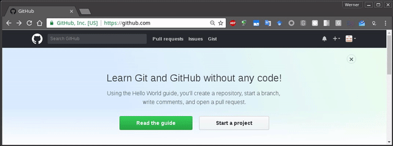
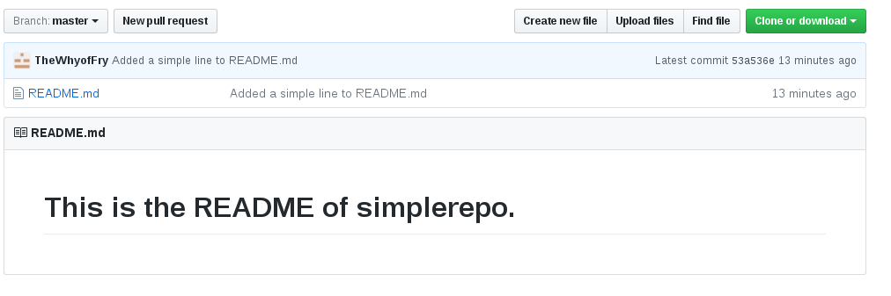
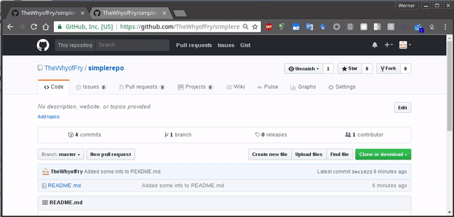

# About this guide

This guide is a very brief overview of ``git`` and will be alinged with the lectures as presented in the lab.  It is by no means a complete guide. Full reference can be found [here](https://git-scm.com/docs) and an online version of the "GitPro" book can be found [here](https://git-scm.com/book/en/v2). You are more than welcome to follow those guides rather than this one if you so desire.


To recap, ``git`` is a version control system. This means that instead of holding single versions of a file, or having copies of files with horrible names such as ``final_report_i_mean_it_this_time.tex`` a history is held as the original file ``report.tex`` changes over time.  By keeping track of _all_ the changes made not only to specific files, but to the entire directory (folder) of your work, project management becomes simpler. Before entering the *_gittening_* we'll revisit a traditional folder setup. Consider the following folder.

 
```shell
$:/tmp/test> ls -l
total 316
-rw-r--r-- 1 werner users 300317 Mar 13 20:49 DATA.txt
-rw-r--r-- 1 werner users  15149 Mar 13 20:49 README.txt
-rw-r--r-- 1 werner users   3125 Mar 13 20:49 REPORT.txt
$:/tmp/test> 
```

There is implicitly no information on previous versions of this file. Your supervisor is reading the introduction of your ``REPORT.TXT`` and emails you a copy back with corrections, ``REPORT_SS.TXT``. This is now the edited and annotated version of the ``REPORT.TXT``. Assuming your supervisor is correct, you rename ``REPORT.TXT`` to ``REPORT_DRAFT1.TXT`` and ``REPORT_SS.TXT`` to ``REPORT_LATEST.TXT``. It's easy to imagine how confusing this process becomes at the 10th iteration of this process. 


```shell
$:/tmp/test> ls -l
-rw-r--r-- 1 werner users  15149 Mar 13 20:49 README_SS.txt
-rw-r--r-- 1 werner users  15149 Mar 29 20:49 README_LATEST.txt
-rw-r--r-- 1 werner users  15149 Mar 15 20:49 README_DRAFT1.txt
-rw-r--r-- 1 werner users  15149 Mar 13 20:49 README.txt
-rw-r--r-- 1 werner users  15149 Mar 13 20:49 README_SS.txt
-rw-r--r-- 1 werner users  15149 Mar 29 20:49 README_LATEST.bak
-rw-r--r-- 1 werner users  15149 Mar 15 20:49 README_DRAFT1.txt
-rw-r--r-- 1 werner users  15149 Mar 13 20:49 README.txt
$:/tmp/test> 
```


Wouldn't it be great if we had intermediate copies of files where changes can be implicitly reviewed by maintaining a history of the files being changed?  You tentatively introduce your supervisor to Git. You get the task of re-organizing the fruits of your research (bad code and all). Enthusiastically, you look up git and decide to get straight to work. Unfortunately, you quickly realize that even though this tool is purpoted to be really really _*really*_ awesome, its use (initially) is not trivial. Add? Push? Pull? Commit? Clone? Blame?! You correctly conclude that it would be better to actually learn git from scratch using toy folders as a starting point. 


## Almost there

A few more things before we start. This guide is rendered in a neat, pretty way as you're reading it.  It is written in "markdown".  You may be familiar with "markup" languages such as HTTML for rendering pretty pages in a browser.  Markdown is a lightweight alternative that allows for the creation of professional looking documents without too much hassle.  You can read more [here](https://guides.github.com/features/mastering-markdown/). Oh, and because the strucutre is simple, it is a trivial task to look at ``diffs`` (more on this later). 

You're viewing this document on GitHub. GitHub is an online resource to store your repositories. The advantage of this is obvious, as it becomes easier toe collaborate with users from all over the world to your project. 


## Installing Git

First, you need to obtain a copy of git. You can download it [here](https://git-scm.com/downloads). Download Git for your operating system, run the installer and follow the instructions.


## Creating a git repository

It isn't absolutely crucial to create a repository on GitHub, but it is prudent to understand the workings of git in the context of a remote repository as you may very well be required to work on projects hosted on Github in the (possibly near :-) ) future.

So first, create an account at [GitHub](https://github.com). The steps are rather intuitive.  Once you've created your account - and please take your time, there is no rush - create an empty repository called "simplerepo" as shown in the clip below. Don't worry about the error message in the example - it just shows that I already created a repository called "simplerepo". This repository will serve as our "clean slate". 




> GitHub will provide you with instructions to create a git repository on your local machine and then migrating it to your newly created repositoery on GitHub.  This is useful if you already have a git repository on your local machine and you just want to make it available on GitHub.  This guide will focus on grabbing a repository and working from there. 


## Cloning the repository from GitHub

Let's clone this repo - literally. We can open a terminal in your favourite OS. Invoke the following command.  Make a folder called "git" anywhere you seem fit.  You should just remember the location so you know where to navigate to in the terminal.  My git folder is in my home folder under ``Sources``

```shell
$:~/Sources/git> git pull https://github.com/[yourchosenusername]/simplerepo.
Cloning into 'simplerepo'...
warning: You appear to have cloned an empty repository.
Checking connectivity... done.
```

Since there is nothing in the repository, ``git`` will let you know.  We can add a  file or one that will be useful later.  Users browsing your repository will like to know what it's all about, so we'll creatre a README file as ``README.md``.  By default, GitHub will display the contents of a ``README.md`` file.  The extension ".md" indicates that the file is in "markdown" format - like this guide. For now, we'll just include a simple line of text to ``README.md``.  You are not obligated to use the ``echo`` command with the appending redirect (``>>``) to create the file, you can use any text editor of your choice. Just ensure that it is not a _word processor_ that saves in a format other than plain text.

```shell
$:~/Sources/git> cd simplerepo

$:~/Sources/git/simplerepo> echo "#This is the README of simplerepo." >> README.md

$:~/Sources/git/simplerepo> cat README.md

#This is the README of simplerepo.
```


##Adding files to the staging area
We need to add this file to the repository. The workflow of adding files to the repository, is:


> 
>   File ---> (EDIT FILE) ---> Add to staging area --> Commit
>


The ``git add`` command adds a file to the _staging_ area.  You can think of this as a state of "limbo".  Whether new or changed, files are always _added_ to the staging area. We can review this ``add`` with the ``git status`` command.

```shell
$:~/Sources/git/simplerepo> git add README.md 
$:~/Sources/git/simplerepo> git status
On branch master

Initial commit

Changes to be committed:
  (use "git rm --cached <file>..." to unstage)

        new file:   README.md
```

There are several components to this message.


* ``On branch master`` : We can have multiple versions of our repository. Generally, we isolate changes to a different _branch_ (Think of a species split) than the master (e.g. a development branch) and when we want to integrate these changes, we _merge_ them into the main branch.  This topic will be dealt with in subsequent guides.
* *``Initial commit``* : We haven't comitted anything to the repository yet
* *``new file:   README.md``* : The file we just added to the staging area


##Commiting the changes to the repository
To fully integrate this file with the repository (making the changes for realsies) we need to issue the ``git commit``. The ``commit`` will _commit_ these changes we've made to the _repository_. 

```shell
$:~/Sources/git/simplerepo> git commit -m "Added a simple line to README.md"
[master (root-commit) c464535] Added a simple line to README.md
 1 file changed, 1 insertion(+)
 create mode 100644 README.md
```

If you go to the repository on GitHub, you'll notice that it is still empty.  We've only comitted the changes we've made to the _local_ copy of our repository.  To make changes to the _remote_ repository, the one on GitHub, ``git push`` is used. It is also necessary to add the _origin_ of this repository so it knows where to ``push`` the commit to. However, because we cloned the repository from GitHub, the remote _origin_ is already there.  For the purpose of this exercise we remove our _origin_ from the repository.

```
$:~/Sources/git/simplerepo> git remote rm origin
```

##Adding a remote repository

The ``git remote add`` command is used to add a remote repository where the changes will be _pushed_ to. 

```
$:~/Sources/git/simplerepo> git remote add origin https://github.com/[yourusername]/simplerepo.git
$:~/Sources/git/simplerepo> git remote 
origin
```

##Pushing the changes to the remote repository 
Great, now we've added a remote repository. The changes can be pushed to the remote github.  The ``git push`` command needs a _origin_ and _branch_ of what needs to be committed. It is also possible to invoke the ``-u`` parameter after ``push`` to save the default _remote orgin_ so that with future commits, just using ``git push`` will suffice.  You will be asked for a username and password.  These are the credentials you use to login to GitHub.  With each push, you will be asked to do this by default. There are ways for git to remember your credentials.  For brevity, this will be covered in another guide.

```
$:~/Sources/git/simplerepo> git push -u origin master
Counting objects: 3, done.
Writing objects: 100% (3/3), 299 bytes | 0 bytes/s, done.
Total 3 (delta 0), reused 0 (delta 0)
To https://github.com/thewhyoffry/simplerepo.git
   51ac36b..53a536e  master -> master
Branch master set up to track remote branch master from origin.
```

The funny numbers are the leading values of a _hash_ calculated for this commit.  Simply put, hashses are unique IDs so we have reference points when we want to refer to a specific commit. The value is actually 40 characters long, but for simplicity only the first seven characters of the has is given.  



## Making changes to README.md

Let's make some changes to ``README.md``. Edit the file and add the following lines to the bottom of the file:

```
>#This is the README of simplerepo.
>
>This repository is a toy repository for the purpose of learning git.
>
> * Markdown!
> Look at the pretty block
```

You can see the difference between ``README.md`` in your working directory and the one in the repository with the ``git diff`` command.

```shell
$~/Sources/git/simplerepo> git diff README.md
diff --git a/README.md b/README.md
index 53a25f6..c511fb5 100644
--- a/README.md
+++ b/README.md
@@ -1 +1,10 @@
 #This is the README of simplerepo.
+
+This repository is a toy repository for the purpose of learning git.
+
+ * Markdown!
+
+
+> Look at the pretty block

The lines starting with ``+`` indicate lines that have been inserted in the edited ``README.md`` compared with the ``README.md`` in the repository. Add ``README.md`` to the staging area with ``git add REAMDE.md`` and check the status of the repository with ``git status``. You'll notice that the _repository_ is up to date, but that there are changes that need to be committed. So even though our changes are in the staging area, the repository is still unaware of it.  

```shell
$~/Sources/git/simplerepo> git add README.md
$~/Sources/git/simplerepo> git status

On branch master
Your branch is up-to-date with 'origin/master'.
Changes to be committed:
  (use "git reset HEAD <file>..." to unstage)

	modified:   README.md
```

Commit the changes with ``git commit -m "[insert your commit message here]"```.

```shell
$~/Sources/git/simplerepo> git commit -m "Added some info to README.md"
[master 3ec1923] Added some info to README.md
 1 file changed, 9 insertions(+)
```

Push the changes to your git repository with ``git push``.


```shell
$~/Sources/git/simplerepo> git push # git push -u origin master saved the repo being pushed to
Counting objects: 3, done.
Delta compression using up to 8 threads.
Compressing objects: 100% (2/2), done.
Writing objects: 100% (3/3), 372 bytes | 0 bytes/s, done.
Total 3 (delta 0), reused 0 (delta 0)
To https://github.com/TheWhyofFry/simplerepo
   53a536e..3ec1923  master -> master
Branch master set up to track remote branch master from origin.


```

You can refresh your repository page on GitHub and marvel at the changes. Clicking on  ``README.md`` will allow you to show the history of commits relating to changes of this file.  You can click on a particular commit, to see the differences between the file and its previous (or other) commits.



So play around with the commands you've learned so far. Make changes, commit etc.  You can even look at the history of this guide by clicking on the "history" button :-) 
(E&OE ;-) )

