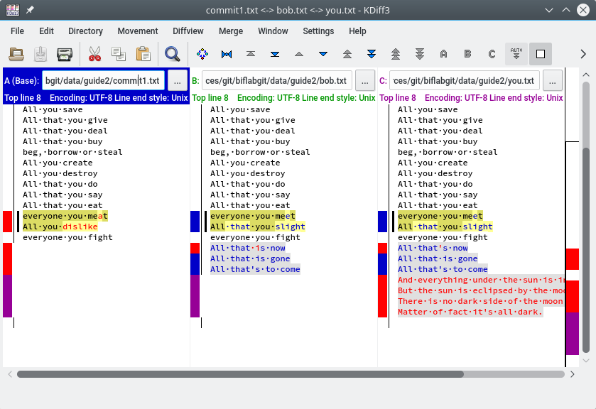

#Ignore this guide in its current form
# Git guide 2 - Resolving conflicts

In an ideal world, everyone involved in a group porject will edited only that which was delegated to them, with the project being modular (split into enough bits) so that there are no more than one person working on a project. In reality, this is a little more tricky and the inevitable conflict will result.  

You may have thought about what we've dealt with previously and reckon: 

> "All well and good, sir, but what if my friend and I work on the same file? Will ``Git`` know who did what and change things in a rational way?"

Well.  Partly yes, but mostly . . no. To give a simple example, lets consider the following block of text - some lyrics from the Pink Floyd song, "Eclipse".  Imagine that only a partial copy of the lyrics are available, because ... reasons.

The copy you receive cannot possibly be complete, because there are only five lines included! How rude. You could listen to the song and capture the rest of the lyrics manually.  Instead, you take this opportunity to test out some Git skills you've learned over the last couple of weeks.  You and a friend (Bob) contribute to correcting and completing the lyrics.  You create an initial commit with the first version of the lyrics (Commit1). Both you and your friend pull the same version of the repository and both of you are in sync.  The initial commit, ``Commit1``.  Bob and you edit your respective copies of ``commit1.txt`` and commit the changes. Bob ``pushes`` his changes to the repository before you, so when you try to do it, ``Git`` complains about a conflict.  

To resolve these conflicts, it helps to use a tool that can show the changes between _three_ copies of the file.  You may think that you only need to look at differences between your file and Bob's file, but remember that you each made changes to the same file. You need to see where the changes are:

 * Trivial - you both edited separate parts of the file, there are no lines edited by either you or Bob that are 
 * Conflicting - Both you and Bob made changes to a line(s) of the lyrics that are _not_ the same and needs to be resolved

To illustrate this, we'll use three copies of imaginary commits (in the data/guide2 folder).  

 * ``commit1.txt`` - The first commit that both you and Bob received
 * ``bob.txt`` - Changes made to ``commit1.txt`` by *Bob*.
 * ``you.txt`` - Changes made to ``commit1.txt`` by *you*.


*commit1.txt*         |  *bob.txt*             |  *you.txt*
----------------------|------------------------|-------------------------------------------
All that you touch    |  All that you touch    |  All that you touch
All that you see      |  All that you see      |  All that you see
All that you taste    |  All that you taste    |  All that you taste
All you feel          |  All you feel          |  All you feel
All that you love     |  All that you love     |  All that you love
All that you hate     |  All that you hate     |  All that you hate
All you distrust      |  All you distrust      |  All you distrust
All you save          |  All you save          |  All you save
All that you give     |  All that you give     |  All that you give
All that you deal     |  All that you deal     |  All that you deal
All that you buy      |  All that you buy      |  All that you buy
beg, borrow or steal  |  beg, borrow or steal  |  beg, borrow or steal
All you create        |  All you create        |  All you create
All you destroy       |  All you destroy       |  All you destroy
All that you do       |  All that you do       |  All that you do
All that you say      |  All that you say      |  All that you say
All that you eat      |  All that you eat      |  All that you eat
everyone you meat     |  everyone you meet     |  everyone you meet
All you dislike       |  All that you slight   |  All that you slight
everyone you fight    |  everyone you fight    |  everyone you fight
.                     |  All that is now       |  All that's now
.                     |  All that is gone      |  All that is gone
.                     |  All that's to come    |  All that's to come
.                     | .                      |  And everything under the sun is in tune
.                     | .                      |  But the sun is eclipsed by the moon.
.                     | .                      |  There is no dark side of the moon really.
.                     | .                      |  Matter of fact it's all dark.


First, download the tool "KDiff3" [here](https://sourceforge.net/projects/kdiff3/files/latest/download). This tool will help with the visualization and resolving conflicts in the edit.  Download the respective files, ``commit1.txt``, ``bob.txt`` and ``you.txt`` to a location of your choosing. Open up a terminal and navigate to the folder containing these files - preferably have a new folder that does not contain any other files.  You can also clone this guide's repository and navigate to the ``data/guide2`` folder.  From the command line (if you're using bash):

```shell
$ biflabgit/data/guide2> kdiff3 commit1.txt bob.txt you.txt
```

The first parameter is the ``base`` file, the copy of the file right at the beginning that you and Bob both had. The second is Bob's edit and the third is yours.  The order is important, since it is _your_ file that will contain the conflict resolved version in the end. After ``KDiff3`` starts up it will present you with three columns. 



The column order follows the order of the file parameters you've given.  The job here is for you to _merge_ the changes into one file, a final version of the edit.  In the majority of cases, the merges can be auto-resolved.  Click on the right-most column (the one for ``you.txt``). Click on the ``Merge -> Merge Current file`` menu option.  ``KDiff3`` will report that there are four conflicts in the file. It could auto-resolve three out of four. 

Instead of doing things line-by-line, diff tries to get blocks of text that are different between files.  The first block deals with the lines:

> everyone you meat
 All you dislike

These lines have both been changed by you and Bob to:

> everyone you **meet**
 All **that** you **slight**

Since both you and Bob's edits are the same, there is no conflict and this part can be auto-merged. The next block of changes are insertions.  These lines did not exist in the original ``commit1.txt`` file and are also shared between your edit and Bob's edit.  So Bob added the lines (for this block):

> All that is now
> All that is gone
> All that's to come

The same block is hilighted in your edit.  However, there is a slight difference between the first line of the block.

> All **that is** now (Bob)
> All **that's** now (You)

This conflict cannot be auto-resolved. When you initially chose the ``Merge -> Merge Current File`` option in ``KDiff3``, it automatically moves to the first line where it cannot automatically resolve a conflict. In the top-right of the window, there are three buttons "A", "B" and "C". Each of them represents the files of column A, B and C, read left to right. If you decide Bob's version is correct, you will click on B.  If you think your version is correct, you will click on C.  Note, however, that you can both select and deselect multiple columns.  However, to resolve the merge (where there is unresolvable conflict) you need to choose _only_ the column of the change you accept.  Bob's version is correct, so choose "B". *``KDiff3`` can be a little quirky at times, so you might not see "A/B/C" being highlighted.  Click on the coloured bar next to the line where the conflict is (in column C)*.

The last block added by you wasn't added by Bob, so the change can be left at the automatic of "C".  You can save the changes, by chosing the ``File -> Save`` option.  It will save the changes to *``you.txt``* unless you specify otherwise.  By default, a copy of the original ``you.txt`` will be made as ``you.txt.orig`` to save you some heartache ;-).  


## Diff 

Another way to see what's going on behind the accepted changes to you, let's see how the new copy of ``you.txt`` (the output from ``KDiff3``) compares to ``bob.txt`` and then how ``bob.txt`` compares with ``you.txt.orig``.  The tool to use is ``diff``.  Diff works similarly to ``KDiff3``, but is focused on comparing two files (three files can be done with ``diff3``). Diff takes in two filenames, compares them and outputs a patch string.  This patch string can be applied to the first file to produce the second file.  Behind the scenes, this is how ``Git`` compares variations of files between commits. 

Using the ``diff`` tool:
```shell
$ biflabgit/data/guide2 > diff bob.txt you.txt
```
```diff
23a24,27
> And everything under the sun is in tune
> But the sun is eclipsed by the moon.
> There is no dark side of the moon really.
> Matter of fact it's all dark.
```

Compared to ``bob.txt`` the file ``you.txt`` adds four lines from line 24 to 27, indicated by ``a``. If you compare ``bob.txt`` to ``you.txt.orig``, diff will output the following:

```diff
21c21
< All that is now
---
> All that's now
23a24,27
> And everything under the sun is in tune
> But the sun is eclipsed by the moon.
> There is no dark side of the moon really.
> Matter of fact it's all dark.
```

So the diff output still shows the added lines, but it also shows that there is a change in line 21. When we merged the files with ``KDiff3`` the conflict in line 21 was resolved, so the only difference between ``bob.txt`` and ``you.txt`` were the added lines.  


## In reality...

It would defeat the purpose of ``Git`` to make each contributor to the ``commit1.txt`` create a separate file. In the real world, versions of ``commit1.txt`` file will be the only one used when resolving the conflicts.  The only difference is that ``commit1.txt`` ``you.txt``, ``bob.txt`` will be replaced by a _base_, _local_ and _remote_ copy.  The ``base`` copy is the original ``commit1.txt`` file that you edited.  The ``local`` copy is the one you edited and the ``remote`` copy is the version of ``commit1.txt`` as it now stands. 

In the previous guide, you were asked to make a repository called ``simplerepo``. Copy the ``commit1.txt``, ``bob.txt`` and ``you.txt`` files to a folder called ``lyrics`` in your ``simplerepo``.  Add the files to the repository, perform a commit and push it to your remote repo.

```shell
$ simplerepo > git add simplerepo/*.txt
$ simplerepo > git commit -m "Added lyrics files"
$ simplerepo > git push # <<- if this doesn't work, try git push -u remote origin 
```

## Double whammy - branch and merge

Let's simulate changes made by you and by Bob. One of the key features of ``Git`` is branching. Branching allows you to work on a "diverged" version of the current tree. The default branch in a ``Git`` repo is the ``master`` branch.  You are by no means forced to adhere to the convention, but this is the branch where everything is supposedly stable.  When you're working on a project, the ideal scenario would be to work on a type of "scratch" copy of your work, with commits not interfering with the main, clean and stable ``master`` branch.  From the perspective of genetics, think of gene duplication events where the copied version of a gene is edited through mutation to perhaps, over time, yield a gene with new features.  The only difference here is that we want to merge the final "gene" with the master gene and enforce our changes on it.  So we have a ``master`` gene that gets copied (branched) to a ``development`` version and then later the ``development`` version is _merged_ onto the ``master`` branch, replacing it. 

How is it applicable here?

Let's make two additional branches in the ``simplerepo`` repository - a ``bob`` branch and a ``you`` branch by using the command ``git branch [branchname]``

```shell

$ simplerepo > git branch bob
$ simplerepo > git branch you
$ simplerepo > git branch -l
  bob
* master
  you
$ simplerepo > git status
On branch master
Your branch is up-to-date with 'origin/master'.
nothing to commit, working directory clean

```

Alright, two branches were created.  The ``branch -l`` command shows a list of branches - you should play around and add more branches.  The command also indicates with an asterisk on what branch you are currently.  The alternative command ``git status`` will also show on which branch you are currently on.  Let's access our Juliard powers of acting and switch to "Bob's" personality (branch :-) ):


```shell

$ simplerepo > git checkout bob
Switched to branch 'bob'
Your branch is up-to-date with 'origin/bob'.
$ simplerepo > git branch -l
* bob
  master
  you
```

Great! Go to the ``lyrics`` folder and replace the contents of ``commit1.txt`` with ``bob.txt``. Add this to the repo and commit the change.  

```shell
$ simplerepo > cd lyrics
$ simplerepo/lyrics > cp bob.txt commit1.txt
$ simplerepo/lyrics > git add commit1.txt
$ simplerepo/lyrics > git commit -m "Replaced commit1.txt with bob.txt"
[bob 395f031] Added bob
 1 file changed, 5 insertions(+), 2 deletions(-)
```

Now do something similar for branch ``you``.  What does the ``commit1.txt`` file look like when you switched to the ``you`` branch? Is it different from what you just saw the ``commit1.txt`` you just changed in the ``bob`` branch?

```shell
$ simplerepo > git checkout you
Switched to branch 'you'
$ simplerepo/lyrics > cd lyrics
$ simplerepo/lyrics  > cp you.txt commit1.txt
$ simplerepo/lyrics  > git add commit1.txt
$ simplerepo/lyrics  > git commit commit1.txt -m "Added you"
[you be418e7] Added you
 1 file changed, 9 insertions(+), 2 deletions(-)

```

Switch back to the ``master branch`` and ... merge the ``bob`` branch.  This will add any changes of the ``bob`` branch to the master branch.

```shell
$ simplerepo > git checkout master
$ simplerepo > git merge bob
Updating 981bd42..395f031
Fast-forward
 lyrics/commit1.txt | 7 +++++--
 1 file changed, 5 insertions(+), 2 deletions(-)
$ simplerepo > git commit -m "Bob's changes"
On branch master
Your branch is ahead of 'origin/master' by 1 commit.
  (use "git push" to publish your local commits)
nothing to commit, working directory clean
```
If you examine the contents of lyrics/commit1.txt, you'll see it's the same as the version in the ``bob`` branch, but not the same version as seen in the ``you`` branch. To quickly see the differences:

```shell
$ simplerepo > git diff you:lyrics/commit1.txt master:/lyrics/commit1.txt
```
```diff
@@ -18,10 +18,6 @@ All that you eat
 everyone you meet
 All that you slight
 everyone you fight
-All that's now
+All that is now
 All that is gone
 All that's to come
-And everything under the sun is in tune
-But the sun is eclipsed by the moon.
-There is no dark side of the moon really.
-Matter of fact it's all dark.
````
```shell
$ simplerepo > git diff bob:lyrics/commit1.txt master:/lyrics/commit1.txt
[nothing]
```

So ``you`` is now out of sync of ``master`` and (implicitly) ``bob``.  Let's merge ``you`` with the ``master`` branch.

```shell
$ simplerepo > git checkout master #just to be sure
$ simplerepo > git merge you
Auto-merging lyrics/commit1.txt
CONFLICT (content): Merge conflict in lyrics/commit1.txt
Automatic merge failed; fix conflicts and then commit the result.
```

Crisis! You know that you can resolve these conflicts with ``KDiff3``, but the example earlier dealt with three different files.  What now? Luckily ``Git`` has a built-in command ``mergetool`` that will open your favourite merge tool (there are others besides ``KDiff3``) to resolve these conflicts.  

```shell
$ simplerepo > git mergetool

This message is displayed because 'merge.tool' is not configured.
See 'git mergetool --tool-help' or 'git help config' for more details.
'git mergetool' will now attempt to use one of the following tools:
opendiff kdiff3 tkdiff xxdiff meld tortoisemerge gvimdiff diffuse diffmerge ecmerge p4merge araxis bc codecompare emerge vimdiff
Merging:
lyrics/commit1.txt

Normal merge conflict for 'lyrics/commit1.txt':
  {local}: modified file
  {remote}: modified file
Hit return to start merge resolution tool (kdiff3): [press enter]
```

[kdiff3merge](images/guide2_gitmerge_kdiff3.png)

Well, something looks familiar here.  Again, most of the conflicts have been resolved, but it's up to you to choose which commit, the local (``you``) or "remote" (not really remote, because we still have the master commit locally, but just humour yourself) version of the pesky line

> All that's now #you 
All that is now #bob

...you want.  Do the commit and save the file.  You cannot use "Save As..." in this case.  Commit your changes and push the master branch to the repo.

[kdiff3merge](images/guide2_gitmerge_kdiff3_choose.png)


```shell

simplerepo > git commit -m "Added you"
simplerepo > git push origin master #The default should still be master
```

All done! You should repeat this exercise with variations of the lyrics.  Get other lyrics/text to play with.  Look at the version histories of the files you add/edit and marvel at the beauty of the commit!


# Bifblast!

The next part of the tutorial is a

# Adding your name to MAINTAINERS.md


