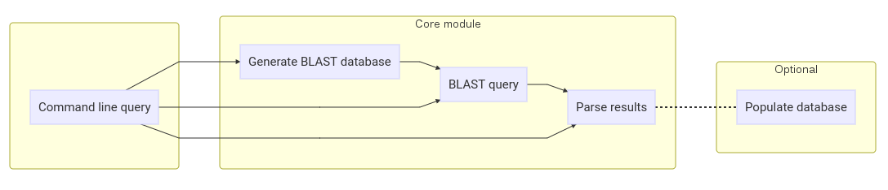

# BifBlast! Introduction

This documentation is a primer for BifBlast! Herein I will list the goals and organization of the code/modules we will develop as a group.  

[Small annex can be found [here](./bifblastannex.md)

- [General usage of BioPython and NCBI BLAST utilities](#general-usage-of-biopython-and-ncbi-blast-utilities)
  * [Brief introduction (recap?) of Python modules](#brief-introduction--recap---of-python-modules)
  * [Examples to get started](#examples-to-get-started)
    + [Creating a BLAST database](#creating-a-blast-database)
    + [Installing BioPython (and packages in general)](#installing-biopython--and-packages-in-general-)
    + [Performing arbitrary BLASTs using BioPython <a name="arbitrary-blast"></a>](#performing-arbitrary-blasts-using-biopython--a-name--arbitrary-blast----a-)
    + [Parsing the results](#parsing-the-results)
- [Core development of BifBlast!](#core-development-of-bifblast-)
- [Goals](#goals)
    + [Module overview](#module-overview)
      - [blastdbgen.py](#blastdbgenpy)
      - [blastdbquery.py](#blastdbquerypy)
      - [blastparser.py](#blastparserpy)
      - [blastdbsqlite.py](#blastdbsqlitepy)
      - [``__init__.py`` and ``__main__.py``](#----init--py---and-----main--py--)
      - [``setup.py``](#--setuppy--)
- [Grab the module!](#grab-the-module-)
- [Contributing](#contributing)


# General usage of BioPython and NCBI BLAST utilities

To get yourself familiar with essential concepts needed in this project, we'll be going over a few basic topics.  First, we'll look at python modules (what they are) and then delve into completing simple BLAST tasks such as database generation and queries. Next, we'll see how you can use BioPython to facilitate this process. 


## Brief introduction (recap?) of Python modules

Python modules allow the encapsulation of a set of functions and classes for re-use. It would be very redundant to copy all the code needed for the ``math`` module into your code to access the functions.  In the simplest case, you can have a single python file with a bunch of functions, ``myfunctions.py``.  In order for another script to use it, it has to import this file with ``import myfunctions``.  Python has a set of paths where it looks for functions (including the current path) and gives an error if it didn't find the functions in the predefined path.  You could, of course, add paths for python to search, but this gets very messy very quickly.  This is why when you install python modules, they are put in a central location.  This location may be accessible system-wide or in a directory that exists user's home folder. 

Usually, python stores (third-party) installed modules in a ``site-packages`` folder, so when you import something it will look inside this folder for the appropriate module. So if you enter ``import Bio`` it will import the ``site-packages/Bio`` module that exists as a subfolder.  Modules may also contain ``submodules`` which can be imported using ``.`` as a separator, for instance ``import Bio.Seq``.  To avoid using the ``Bio.`` prefix, one can also use ``from Bio import Seq`` and then access the ``Seq`` modules contents with ``Seq.``. 

Methods for installing python modules are discussed in conjunction with usage examples of BioPython in subsequent sections. 


## Examples to get started

To help you get started, we'll look at some of the basic interfaces to BioPython as well as creating a BLAST database from the command line.  The code will generally follow the BioPython [cookbook](http://biopython.org/DIST/docs/tutorial/Tutorial.html).  These examples are merely to help you get familiar with everything.  While your code may look similar in the end, please try not to copy-and-paste from here.  


### Creating a BLAST database

Creating a BLAST database is straightforward.  You will need the [NCBI BLAST+ tools](http://ftp.ncbi.nlm.nih.gov/blast/executables/blast+/LATEST/). Download the relevant file for your operating system and install (Windows: ``.exe``, Lab PCs: ``.x86_64.rpm``).  These tools are also essential for BioPython's local BLAST functionality.  You would also need a [test](https://raw.githubusercontent.com/TheWhyofFry/biflabgit/master/data/test.fsa) file for this exercise, although you can use your own FASTA file. 

The ``makeblastdb`` command is used to create BLAST databases.  Specify at least an input FASTA file with the ``-in`` flag (test.fsa), the type of database (nucleotide/protein) with the ``-dbtype`` flag. The ``-out`` flag is used to name the output database, which will act as a reference when using it in a BLAST search.


* Creating a database
```bash
$ > makeblastdb -in test.fsa -dbtype nucl -out test         
... 
$ > blastn -query test.fsa -db test # Just to check. 

$ > ls -l test*

-rw-r--r-- 1 werner.local users 2199 May  4 08:13 test.fsa
-rw-r--r-- 1 werner.local users  276 May  4 08:15 test.nhr
-rw-r--r-- 1 werner.local users  104 May  4 08:15 test.nin
-rw-r--r-- 1 werner.local users  524 May  4 08:15 test.nsq

```

You'll see a bunch of files that were created by the ``makeblastdb`` command. When referencing the databse, use the name ``test``.  If you don't include a name, the ``test`` file will include the ``.fsa`` suffix (so test.nin would be test.fsa.nin) and you'll need to do a ``blastn`` query with ``-db test.fsa``.


### Installing BioPython (and packages in general)

OK, let's backtrack a bit. If you are unsure how to install Python packages, continue to read this section.  If you are comfortable installing packages, you may skip to the [next](#arbitrary-blast) section. Python packages, as stated, are a collection of files that provide functionality beyond the basic Python install.  In our case, we want to install BioPython. The ``pip`` command is used to install Python packages.  Usually, ``pip install biopython`` should suffice. However, many operating systems nowadays come with different versions of Python.  We will be using Python 2.7.  If you installed BioPython and it still appears missing, consider using ``pip2.7 install biopython``. There is another reason why it can b

If you're using the lab PCs, you may need some extra configurations in order to get an internet connection.  I can't put the details on a public guide, so feel free to ask me :-) 

Note that using ``pip install`` will install a package *system wide*.  This means that it will be accessible to all users that can log in to your PC.  In order for it to work, you will need Adminsitrative privileges.  So on your lab PCs, you would need to execute ``sudo pip install biopython``.  If you would like to not install it system wide, you may use ``sudo pip install --user biopython``.  This will install the packages in the home folder. For the time being, I would suggest installing it system wide instead of as a local user.

Packages that have dependencies, i.e. other packages that need to be installed for them to work, grab and install them too.  BioPython is partly dependent on ``Numpy`` but does not automatically install it for you.


```bash

$ > pip2.7 install biopython
Collecting biopython
  Downloading biopython-1.69.tar.gz (15.4MB)
    100% |████████████████████████████████| 15.4MB 43kB/s 
Building wheels for collected packages: biopython
....


$ > python
>>> import Bio.Blast
```

If all went well, there shouldn't be any errors.  Ahem, except for a moaning by BioPython about "NumPy" not being installed and that it recommends installing NumPy prior to installing BioPython.  NumPy is a large python package that contains a multitude of methods and classes that facilitate the processing of numerical data in python. So let's install ``NumPy`` and then reinstall ``BioPython``. Please note that if you _*did not get an error about numpy*_, that's OK.

```shell

$ > sudo pip install numpy #Install NumPy
Collecting numpy
  Downloading numpy-1.12.1-cp27-cp27mu-manylinux1_x86_64.whl (16.5MB)
    100% |████████████████████████████████| 16.5MB 88kB/s 
Installing collected packages: numpy

$ > sudo pip uninstall biopython
....
Proceed (y/n)? y 
Successfully uninstalled biopython-1.69

$ > pip install biopython
Collecting biopython
  Using cached biopython-1.69.tar.gz
Building wheels for collected packages: biopython
  Running setup.py bdist_wheel for biopython ... done

```


Then, reinstall BioPython as you did before (you can streamline the process after installing NumPy with ``pip install --force-reinstall biopython``).  There should (hopefully) be no errors :-) If you do get some errors trying out the commands, check if you prefixed the ``pip`` command with ``sudo``. Alternatively, use the ``pip install --user biopython`` command.


### Performing arbitrary BLASTs using BioPython <a name="arbitrary-blast"></a>

Assuming you have BioPython installed and your BLAST database has been created, we'll delve a little into a basic usage of BioPython by BLASTing a sequences from the ``test`` BLAST database against itself.

If you followed the creation of a BLAST database, you would've noticed the default output of ``blastn`` is similar to the pretty textual outputs you would get when running BLAST on the NCBI. However, we would like to interface with these results.  Now, prior to parsing (processing the results) BioPython generates the command line similarly like what was done earlier in this guide. In the following code, ``bc`` acts as a function (not enitrely true - check if you can figure out why) that will execute the ``blastn`` command for us.  First, we define ``bc`` with ``NcbiblastnCommandline`` and then run it as a normal function. A tuple is produced as an output.  The first part of the tuple being the actual output (from ``stdout``) and the second part being the error/information output (from ``stderr``). We can directly assign variabled from a touple in the form ``a, b = (0, 1)``.  The ``a`` variable will take on the value ``0`` while the ``b`` variable will take on the value ``1``.

```python
from Bio.Blast.Applications import NcbiblastnCommandline
bc = NcbiblastnCommandline(query="test.fsa", db="test", evalue=0.001, outfmt=5)
print bc
output, error = bc()
print output[:100]
```

The output should yield
```
    blastn -outfmt 5 -query test.fsa -db test -evalue 0.001

    <?xml version="1.0"?>
    <!DOCTYPE BlastOutput PUBLIC "-//NCBI//NCBI BlastOutput/EN" "http://www.ncbi.n
```


When creating ``bc`` you can add other parameters, such as ``out=test.xml`` that will output the result to a file or ``strand='plus'`` that will only BLAST the positive sense strand of the query.  Feel free to look at the documentation of ``NcbiblastnCommandline`` and ``blastn`` for other parameters.  Play around with them.  What happens when you change the ``outfmt`` parameter to ``7``? For the next part,  the ``output`` should be in format ``7`` (XML).


### Parsing the results

The results produced by ``NcbiblastnCommandline`` cannot directly be interpreted by python other than that the results are a string.  We next need to parse the results.  A parser input text and interprets it intelligently, pushing the results onto a Python object.  So instead of scanning visually through the results, we may use the parser to convert the results into something Python can easily access/manipulate/filter. By default, BLAST will produce an XML formatted output. Although the raw version of the results are not clear to interpret, it makes it easier to parse these results.  The ``NCBIXML`` module in ``Bio.Blast`` acts as a parser of BLAST results.

Something to note, is that the ``NCBIXML`` parser assumes that the input would be a file or a file handle. We can trick it into believing the input is a file (even though it's a string) by using the ``StringIO`` module that disguises the string as a file. Of course, we could skip this step if our previous results were directly saved to a file (e.g, if you specified ``out='test.xml'``).


```python

>>> from Bio.Blast import NCBIXML
>>> import StringIO
>>> output_handle = StringIO.StringIO(output) #Create a file handle of the output string
>>> parsed_result = NCBIXML.parse(output_handle)
>>> print parsed_result
<generator object parse at 0x7f95064d39b0>
>>> blast_result = list(parsed_result)
>>> print blast_result
[<Bio.Blast.Record.Blast at 0x7fb43bfec650>, ... ]
>>> r = blast_result[0]
>>> a = r.alignments[0]
>>> h = a.hsps[0]
>>> print a
>>> print h
```
```
gnl|BL_ORD_ID|1 gnl|MYDB|2 this is sequence 2
           Length = 720
Score 720 (1330 bits), expectation 0.0e+00, alignment length 720
Query:       1 GAATTCCCGCTACAGGGGGGGCCTGAGGCACTGCAGAAAGTGGGC...CAA 720
               |||||||||||||||||||||||||||||||||||||||||||||...|||
Sbjct:       1 GAATTCCCGCTACAGGGGGGGCCTGAGGCACTGCAGAAAGTGGGC...CAA 720

```

The parser yield a ``generator`` object, ``parsed_result``.  Loosely, a generator object allows you to retrieve information (alignments in this case) one by one instead of getting all the results as one.  This is useful if you intend to do massive BLAST queries. If you would like to get all the results into a list anyway, you can get all the generator has to give by directly calling ``list(parsed_result)``.  There are three sequences in the file, and therefore three alignments are to be expected. The ``r`` variable is a placeholder for the first element in ``blast_result``. The ``a`` variable is the first alignment of the BLAST result and ``h`` is the first ``High Scoring Pair (HSP)`` of that result (i.e. the first hit). You can print the alignments/hits to give you a good visual representation.  Refer to the BioPython cookbook on [parsing the results](http://biopython.org/DIST/docs/tutorial/Tutorial.html#htoc93). Later on, when the web front-end is created, the more sophisticated aspects of the parser will be utilized.


# Core development of BifBlast!

Now that you're semi-familiar with the basic aspects of a local BLAST query and how to use BioPython to submit queries and results, we'll discuss the outline of the BifBlast! project.  The project will be divided into two main parts:
* Core BLAST module
* Web front-end.

These two parts need to be separated as it is preferable to keep things modular.  For instance, if you wanted to create your own web front-end, you don't want to be dependent on the original web-front end to start from scratch.  The core module will handle all the finer details of BLAST queries, database generation, parsing etc. The web front-end needs to interface with this core module, but should preferably not contain too much code that could have been included in the core module to start off with. 



# Goals
* Develop a core backend that can:
	* Create a BLAST database from a list of sequences
	* Perform arbitrary blasts against this database
	* Parse the results
	* Keep a reference of the created BLAST databases in a SQLite database
	* Allow the module to be executed as a stand-alone application
		* e.g. ``python -m bifblast --createdb MYBLASTDB --sequences MYSEQUENCES --dbtype nt``
* Transform this into a neat Python package
* Continuously update the Git repository


### Module overview

For each task, a separate Python script will be created.  This means that BLAST database generation functions will not be group together with BLAST query functions.  The reason for this is to make our library as modular as possible.  This allows for a smoother history and if bugs do creep up, we can easily isolate them to a particular module. 

The Biopython package already provides most of the functionality for our project, so most of the core functions will just act as shorthand versions.  This step is a bit redundant, but I would like, especially the Hons students, to get familiar with general Python concepts too. 


Lets look at the general structure of our core package and discuss each file in turn. 

```bash
.
├── bifblast
│   ├── blastargparser.py
│   ├── blastdbgen.py
│   ├── blastdbsqlite.py
│   ├── blastparser.py
│   ├── blastquery.py
│   ├── __init__.py
│   ├── __main__.py
│   └── setup.py
├── MAINTAINERS.md
└── README.md

```


#### blastdbgen.py

This file will handle the blastdb generation queries.  It will accept a file as input with options stating whether it is a protein or nucleotide BLAST database.  While this seems trivial, we need to take a few things into account:
	
* The input file must be in _valid_ FASTA format
* The headers of the FASTA entries may not include escape characters (such as tab)
* An option should exist to automatically determine if the input sequences are protein or nucleotide sequences (within reason)

As far as I know (waiting for the egg on my face) there is no direct way to create a blast database from wihthin BioPython. To this end, we will need to create a function that interfaces with the NCBI BLAST+ suite to create a blast database for us. From a usage perspective, the BLAST database generation should happen via a single function call.

You will need to learn:

* The [argparse](https://docs.python.org/2.7/library/argparse.html) module.  Also check [this](https://docs.python.org/2/howto/argparse.html) tutorial and feel ... patriotic.
* The [subprocess](http://sharats.me/the-ever-useful-and-neat-subprocess-module.html) module.


#### blastdbquery.py

This module will facilitate the execution of BLAST queries.  Essentially, a function will be written that can execute the query (via BioPython) but also handle where the raw results (before parsing) are to be stored. There should be an option for the user to get a raw string output or output the results to a file.  While there can be an option choosing what format the output should be, the default needs to be XML, since it can convert to any other format (e.g. tab-delimited).  As with ``blastdbgen``, sequences need to be validated as valid FASTA. It is necessary to consider the possibility of the type of BLAST the user would like to perform (just blastn and blastp for now).  This can be determined automatically from the input sequence.  Consider, howver, that the user may want to do a ``tblastn`` (searching against a nucleotide db using a protein query) or a blastx (searching against a protein db using a nucleotide query).  You do not have to code for this, but make sure that your code can be easily extended to include these options. 

#### blastparser.py

This module will parse raw BLAST results.  It will contain functions that can both parse and selectively extract info from the BLAST hits. Deviating slightly from the pure modular design, it should also be able to call the necessary BioPython functions that allow conversion between the BLAST output formats. 

The [pandas](http://pandas.pydata.org/) Python module is great for working with (among other things) tabular data.  BLAST results can be converted to tabular format and if structured appropriately, it will make filtering BLAST results a lot easier, e.g. filtering by E-value, bit score, query hit size etc.  Make sure the module has built-in function that can filter by at least E-value.  You may include other criteria.  How does Pandas fit in? Check the tabular output format of BLAST results and read up a little on pandas.  It is not crucial for you to learn Pandas at this stage, but it would make the filtering process a lot easier. 

Ideally, this module should also include a summary statistic that includes:
* Number of hits found per BLAST query
* Total coverage of the BLAST query 

#### blastdbsqlite.py

Not absolutely necessary for the core module to succeed, but given that we eventually want a web interface for this project, it seems prudent to keep a structured record of all the BLAST databases that have been created.  This allows the user to access previously created BLAST databases using a key and a reference BLAST database.  This module will not be assigned to anyone per se, but if you would like to work on this, let me know.  I'd suggest you read up on the [SqlAlchemy](https://www.sqlalchemy.org) module.

#### ``__init__.py`` and ``__main__.py``

These two files are necessary for packaging our module.  The ``__init__.py`` both indicates that the ``bifblast`` directory should be treated as a module and the files therein can be imported as ``from bifblast import blastdbgen``, ``import bifblast.blastdbgen`` etc.  It also allows some module initialization (and other packaging functions). The ``__main__.py`` file helps with the execution of the module as a command.  Subsequent lectures will delve into more detail.

#### ``setup.py``

This file will contain the necessary functions to setup/install the package. We'll cover its usage in another tutorial.


# Grab the module!

* Right, so it's a bit of a wasteland, but you may get the current commit of the BifBlast! repo. To clone the repo, issue the folling command in a shell:

```shell
$ > git clone https://github.com/TheWhyofFry/bifblast
$ > cd bifblast
$ (master) bifblast >
```

* Now, switch to the ``development`` branch:

```shell
$ (master) bifblast > git checkout development
$ (development) bifblast > 
```

* Create a new branch for yourself:

```shell
$ (development) bifblast > git branch test
# Alternatively, you can be on the master branch and create a test branch from the ``development branch``
$ (development) bifblast > git branch test development 
$ (development) bifblast > git checkout test
$ (test) bifblast >
```

* Install the package

```shell
$ (test) bifblast > pip install --user -e bifblast
```

This will install the ``bifblast`` module that exists in the ``bifblast/bifblast`` folder. The ``-e`` flag is used, so that we can enter ``development`` mode.  Instead of installing the module with actual files, symbolic links are used. Symbolic links act as a reference to a file in another location.  So when you change anything in the ``bifblast/bifblast`` folder, the changes are reflected in the package. 


# Contributing

For now, you should not push any changes you make to the remote repository. I haven't put restrictions on the ``development`` branch.  You may (and should) play around with your ``test`` branch.  Even though you have been assigned into groups, I want you all to be familiar with most of the aspects of the project. If you are assigned to developing the ``blastparser`` module, you still should be able to do BioPython-based blast queries. I will formally assign roles to you after our next meeting.

If you have any questions, feel free to ask :-)


